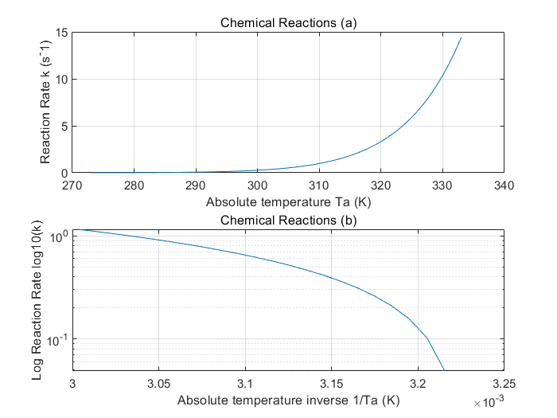
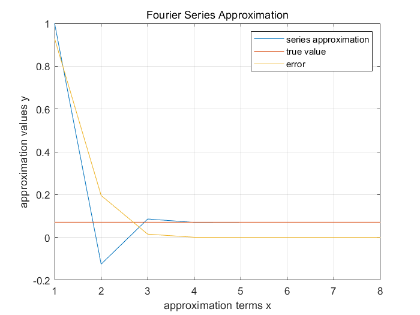

# Numerical Analysis and Computational Analysis
Numerical Analysis and Computational Analysis with MATLAB, Python and CUDA C

## Examples


```
<Chemical Reactions>
k = Ae^-E/(RTa)

<Fourier Series Approximation>
cos x = 1
cos x = 1 - x^2/2!
cos x = 1 - x^2/2! + x^4/4!
        .
        .
        .
Then, calculate error (approximation - true value)

```

<p align="center">
  
  
</p>
